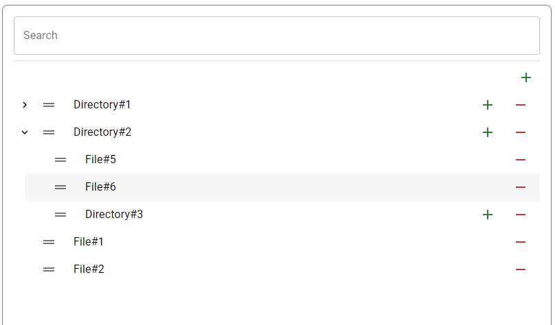

# Test App

## Install packages

```bash
npm i
```

## Run dev mode

```bash
npm run start-dev
```

## Run test

```bash
npm run test
```

## Structure

The API data response is located at the path /src/api/data.json. This file is base DB for the app, since the object is stored in localStorage after the first application launch. A regular file and folder are one entity - a document. The folder can simply be specified as folderId for documents which are inside.

Test-case is located at the path /src/pages/DocumentsPage/**tests**/DocumentsSearch.test.

To add a document you need to click '+', to remove '-' respectively. The transfer of documents is done via drag and drop. To move a document to a folder you need to drag the '=' icon and drop on the title of the folder you want to move to.


